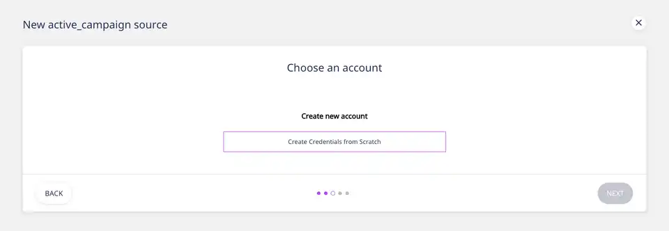
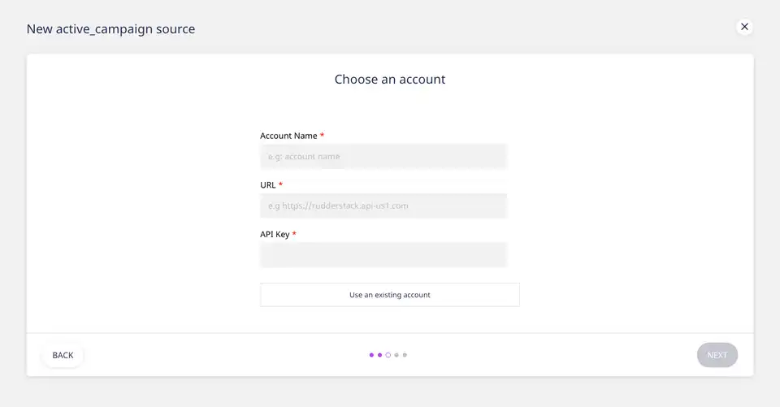
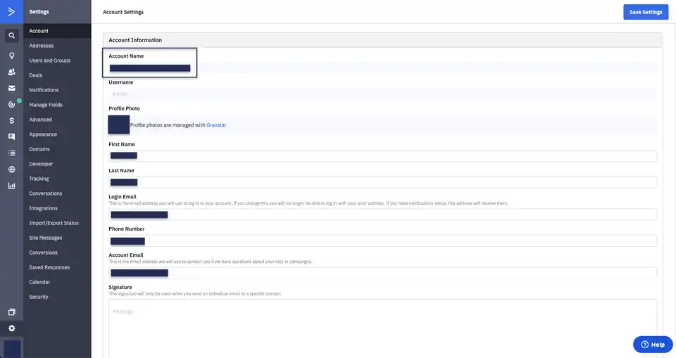
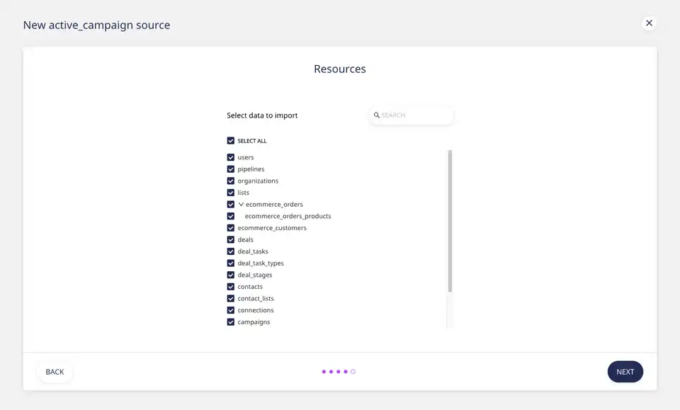
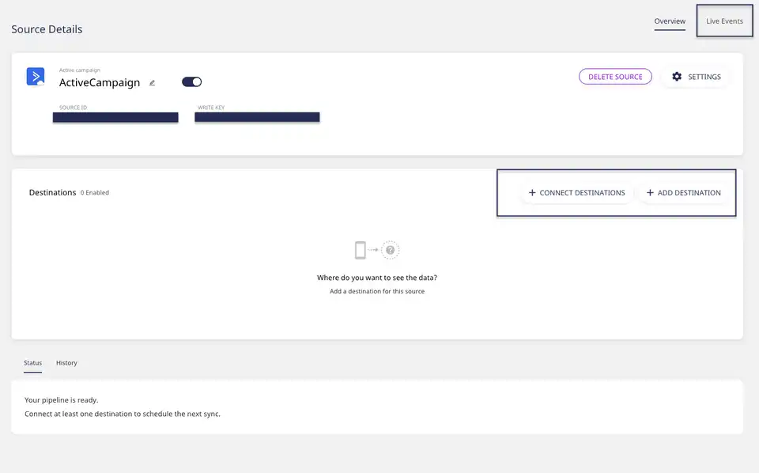

# ActiveCampaign

[**ActiveCampaign**](https://www.activecampaign.com/) is a popular marketing automation and CRM platform that lets you drive effective customer engagement and retention. With ActiveCampaign's all-in-one email marketing and growth platform, you can easily monitor your customers' product behavior and use the insights to design and drive highly personalized customer experiences.

This guide will help you set up ActiveCampaign as a source in RudderStack. Once configured, RudderStack automatically ingests your specified ActiveCampaign data and routes it to the supported [**warehouse destinations**](https://rudderstack.com/docs/data-warehouse-integrations/).

<strong>All the Cloud Extract sources support sending data only to a data warehouse destination.</strong>

## Getting started

To set up ActiveCampaign as a source on the RudderStack dashboard, follow these steps:

- Log into your [**RudderStack dashboard**](https://app.rudderstack.com).

- Then, click on the **Directory** option present in the left navigation panel and go to **Cloud Extract** under **Sources**. From the list of sources, click on **ActiveCampaign**.

- Assign a name to your source, and click on **Next**.

### Specifying connection credentials

- Next, click on the **Create Credentials from Scratch** option, as shown:

  If you've already configured ActiveCampaign as a source before, you can select the account under the <strong>Use existing credentials</strong> tab.

- Then, enter the required connection credentials to give RudderStack access to your ActiveCampaign account.

The settings are:

- **Account Name**: Enter your ActiveCampaign account name. To get your ActiveCampaign account name, go to your ActiveCampaign dashboard and navigate to **Settings** - **Account**.

- **URL**: This refers to your ActiveCampaign API access URL. You can get it by going to your dashboard and navigating to **Settings** - **Developer**.

- **API Key**: Enter your ActiveCampaign API key in this field. You can get it by going to your dashboard and navigating to **Settings** - **Developer**.

### Setting the table prefix, run frequency and data update schedule

- Next, you will be required to set the **Table Prefix**. RudderStack will create a table in your data warehouse with this prefix name and load all your ActiveCampaign data into it.

- Also, set the **Run Frequency** to schedule the data import from your ActiveCampaign account to RudderStack. Optionally, you can also specify the time when you want this synchronization to start, by choosing the time under the **Sync Starting At** option.

### Selecting the data to import

- Finally, choose the ActiveCampaign data that you wish to ingest via RudderStack. You can either select all the data, or choose specific ActiveCampaign data attributes, as per your requirement.

That's it! ActiveCampaign is now successfully configured as a source on your RudderStack dashboard.

RudderStack will start ingesting data from ActiveCampaign as per the specified frequency. You can further connect this source to your data warehouse by clicking on **Connect Destinations** or **Add Destinations**, as shown:

Select the <strong>Use Existing Destination</strong> option if you have already configured a data warehouse destination in RudderStack. To configure a data warehouse destination from scratch, select the <strong>Create New Destination</strong> option.

## FAQs

#### Is it possible to have multiple Cloud Extract sources writing to the same schema?

Yes, it is.

We have implemented a feature wherein RudderStack associates a table prefix for every Cloud Extract source writing to a warehouse schema. This way, multiple Cloud Extract sources can write to the same schema with different table prefixes.

## Contact us

For queries on any of the sections covered in this guide, you can [**contact us**](mailto:%20docs@rudderstack.com) or start a conversation on our [**Slack**](https://rudderstack.com/join-rudderstack-slack-community) channel.
